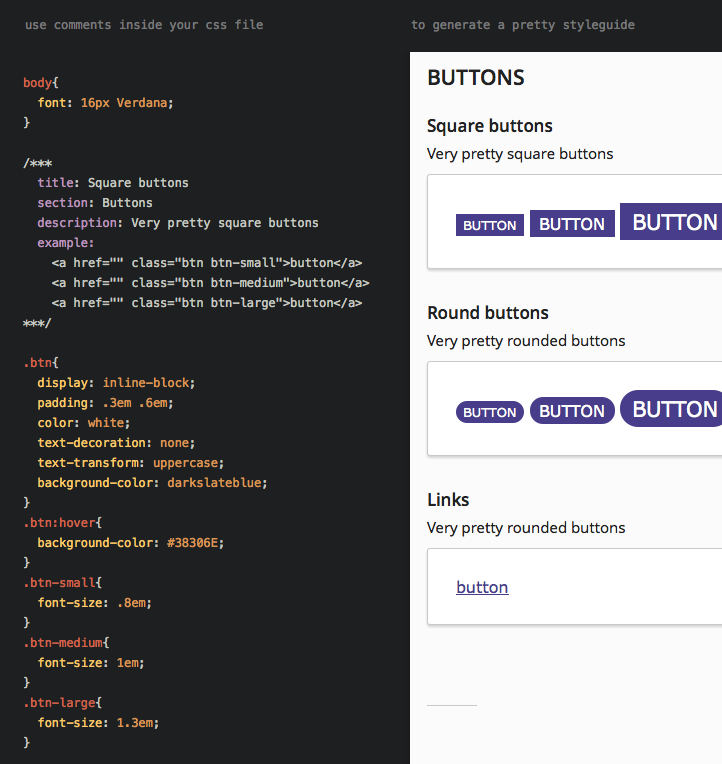

styleguide.js
=============

Generate a styleguide from your CSS, by adding [YAML](http://en.wikipedia.org/wiki/YAML) data in the comments. 
It generates a [self-contained html](test/index.html) file. Works great for component based CSS.


### Install
Just run `npm install styleguidejs`.


### How to use
You can add comments to your css. When it has three asterisks, it will be parsed as YAML data.
The properties `title`, `section` and `example` are required by the default template, 
but when using your own you can add all the things you would like. (like browser support, media query etc...)

````css
body {
  font: 18px Verdana;
}

/***
  title: Test
  section: Forms
  description: This is a description, and can also contain **Markdown**
  example: |
    <div class="test">This is a test</div>
    <div class="test2">This is another test</div>
***/
.test,
.test2,
.test2[fancy=true] {
  background: blue;
  color: #fff;
}


/***
  title: Another test
  section: Forms - Common
  example: <input type="text" class="test">
***/
input.test {
  background: green;
}
````


````js
var StyleGuide = require('../index');

sg = new StyleGuide('My Styleguide');
sg.parseFile("mystyle.css");
sg.includeJS("modernizr.js");
sg.includeJS("jquery.js");
sg.renderToFile("test/index.html");
````

See /test for a demo implementation, and demo export file (index.html). You can add your own properties in the Yaml data,
and parse them in your custom template.


### API
`constructor( title, engine='jade' )`

Create instance, and set the title for your guide. By default the Jade template engine is used to generate the output. 
See the docs of [Consolidate.js](https://github.com/visionmedia/consolidate.js) for available options.

`parseFile( css_file )` and `parseCSS( css_source )`

Read the given css file/source and parse all styleguide comments. The file is also used in the export.
Can only be called once per instance.

`includeJS( js_file )`

Adds this file to the export. You can use this to load scripts like Modernizr into the page.

`collectYaml( source )`

Collect the Yaml data comments in the given source. Is used internally, but can be used for your own magic.

`renderToFile( dest_file, template='template/index.jade' )`

Render the styleguide to this file, with the given template. 


### Grunt task
A simple Grunt task, written in coffeescript.

````coffee
grunt.task.registerTask 'styleguide', 'Generate nice styleguide', ->
  styleguide = require 'styleguide'

  s = new styleguide('My Styleguide')
  s.parseFile "styleguide/all.css"
  s.includeJS "styleguide/all.js"
  s.renderToFile "styleguide/index.html"
````


### Screenshot ([source](test/index.html))

